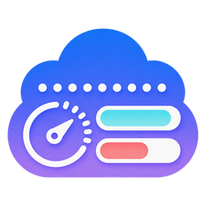

[English](./README.md) · 简体中文 · [繁體中文](./README_ZH_HANT.md) · [한국어](./README_KO.md) · [日本語](./README_JA.md) · [Русский](./README_RU.md) · [Français](./README_FR.md)

<p align="center"></p>

# CodexRunway · Klain97710 定制版

面向亲友使用的 macOS 菜单栏 Codex 工具。基于 [Licoy/CodexRunway](https://github.com/Licoy/CodexRunway)，首版 **0.1.0（1000）**，只启用 Codex，保留原有界面和本地数据格式。

本版用于**覆盖原版**：继续使用 `CodexRunway.app`、原应用和 Widget 标识、URL scheme、Keychain 项目及 `~/.codex-runway` 数据目录。首次手动替换，后续从本仓库的签名更新源更新。

## 安装与首次使用

1. 从 [个人仓库 Releases](https://github.com/Klain97710/CodexRunway/releases/latest) 下载 DMG：Apple Silicon 选 `CodexRunway-macos-arm64.dmg`，Intel 选 `CodexRunway-macos-x86_64.dmg`。主应用需要 macOS 12+，桌面组件需要 macOS 14+。
2. 退出正在运行的 CodexRunway。已有用户先备份旧应用与偏好，再将 DMG 内的应用覆盖到**原安装位置**；新用户拖到 Applications。
3. Homebrew 用户先执行 `brew uninstall --cask codex-runway`，**不要加 `--zap`**，然后手动安装本版，以免原渠道覆盖定制版。
4. 本版免费采用 ad-hoc 签名，未做 Apple 公证。首次打开可右键选择“打开”，或到“系统设置 → 隐私与安全性 → 仍要打开”。仅对来源和 SHA256 已核验的下载处理安全提示。
5. 点击菜单栏图标打开面板。已有账号自动沿用；新用户进入设置的账号页面，选择“导入当前登录”，或通过浏览器登录、导入文件、粘贴凭据添加账号。刷新后查看配额。API Key 账号不提供 ChatGPT 订阅额度。

应用没有 Dock 图标。若菜单栏被隐藏，可执行：

```bash
open -a /Applications/CodexRunway.app 'codex-runway://widget?provider=codex&section=overview'
```

应用装在 `~/Applications` 时使用对应路径。首次安装的开机启动按 macOS 授权处理；已有用户的设置会保留。

详细步骤：[安装、覆盖升级与回退](docs/development/install-upgrade.md)。

## 保留的能力

- Codex 登录与多账号管理、别名、导入、显式切号及配额刷新。
- 5 小时、每周及附加额度、官方 reset credits、额度估算与提醒。
- API 等价成本、Token 热力图 / 折线图 / 柱状图、最近会话和会话索引修复。
- Codex 重置动态：默认开启，每 5 分钟查询公开状态；保留提醒、来源链接及 Widget。已关闭过的用户仍保持关闭。
- macOS 14+ 桌面组件：额度、Token 趋势、关键指标、重置动态。
- 七种界面语言、浅色 / 深色 / 跟随系统、HTTP / SOCKS5 / 系统代理。
- 慢请求与本地统计并发；失败提示、旧数据时间戳及默认关闭的脱敏网络诊断。

Grok 的实现、数据类型和测试保留在源码中，但正式版没有开启入口，不探测 CLI、不读取其凭据或会话、不发起其网络请求。旧 Grok / Both 选择转为 Codex，其他偏好不变，旧数据不删除。重置动态的“求重置 / 感谢”按钮、计数和互动请求已删除。

## 更新与回退

- 正式版默认自动检查，用户确认后才下载安装。应用主页、反馈、下载白名单和 Sparkle 更新清单均指向 `Klain97710/CodexRunway`。
- 首次从原版切换必须手动安装。签名错误、下载损坏或代理不可用时，当前应用保留，不改用原作者更新源。
- 开发包禁用在线更新。正式包必须包含有效公钥，发布前还会验证私钥与公钥匹配。
- 回退时退出应用，将备份应用放回原位置；需要时恢复备份偏好。账号库与会话保留原地。回退到原作者应用后，其更新源也随之恢复。

发布包含 DMG、ZIP、app.tar.gz、签名 appcast、SHA256SUMS 和对应源码标签。首版标签为 `personal-v0.1.0`。

## 网络与隐私

在“控制面板 → 通用 → 网络”设置代理，保存后生效。测试连接只读取本仓库公共页面，不依赖首个 Release 或 appcast，不发送账号凭据。自定义代理失败时不自动直连，代理密码单独保存在 Keychain。

- 官方凭据来自本机 `~/.codex/auth.json`；托管副本位于 `~/.codex-runway/accounts/<id>/auth.json`，目录权限 0700、文件权限 0600，账号索引不含 token。
- 安装迁移本身不写官方认证文件。运行中仅在 OAuth 刷新或用户主动切号时，按原有规则更新官方认证；刷新非当前托管账号时只写其副本。
- Token、API Key、认证 JSON 不进入日志或发布包。会话内容不上传，缓存和派生索引保存在 `~/.codex-runway`。
- 会话修复只重建 `~/.codex/session_index.jsonl`，先备份，不删除会话文件。
- 重置动态只请求 [Did Codex Reset 公开状态](https://didcodexreset.com/api/status.json)，不附带账号、token、会话、访客标识，不发送 `/api/reaction` 请求，也不读写旧访客文件。第三方状态可能延迟或不可用，AI 分析仅供参考。
- 配额、reset credits、额度估算及官方 Token 统计访问 ChatGPT / Codex 后端。官方数据仅对应当前账号；本机日志可能跨账号，不能把两者直接相减。
- 额度估算采用派生 Credits 与周占用率外推（1000 Credits ≈ $40，规则版本 `credits-usd-2026-08-26`），不是官方承诺。API 价格按随包价目及在线价格源计算，未知模型不显示精确费用。
- Widget 只读权限 0600 的 `~/.codex-runway/widget-snapshot.json`，只发布 Codex 派生数据，不含邮箱、账号 ID 或密钥。

## 本地开发与打包

需要 Swift 6 / Xcode；本机已验证 Xcode 16.4、Swift 6.1.2。先退出安装版，再运行：

```bash
swift test
swift build
swift run CodexRunway
swift run CodexRunway --self-check
ARCH=arm64 bash Scripts/package-app.sh
bash Scripts/verify-packaged-app.sh dist/CodexRunway.app arm64 local
```

macOS 14+ 的开发启动会组装带 Widget 的独立 Dev app，保留单实例约束，并共享现有账号目录；它并不隔离真实用户数据。自检只输出本地 Codex 脱敏诊断，不访问 Grok。

默认打包为禁用更新的开发包。正式签名、双架构打包和发布步骤见 [发布维护](docs/development/personal-release.md)。历史本机启动记录见 [local-run](docs/development/local-run.md)，本次验收见 [首版验收](docs/development/personal-v0.1.0-verification.md)。

`personal/main` 用于定制版集成和发布；`main` 保留上游基线。只推送 `personal-v*` 发布标签，先形成草稿、验收后再公开。后续同步上游重点复核发布地址、功能限制和偏好迁移。

## 来源与许可

原项目：[Licoy/CodexRunway](https://github.com/Licoy/CodexRunway)。定制维护：[Klain97710/CodexRunway](https://github.com/Klain97710/CodexRunway)。保留原作者署名、[贡献者](CONTRIBUTORS.md)及 [AGPL-3.0 许可证](LICENSE)，各发布版本源码通过对应标签公开。
